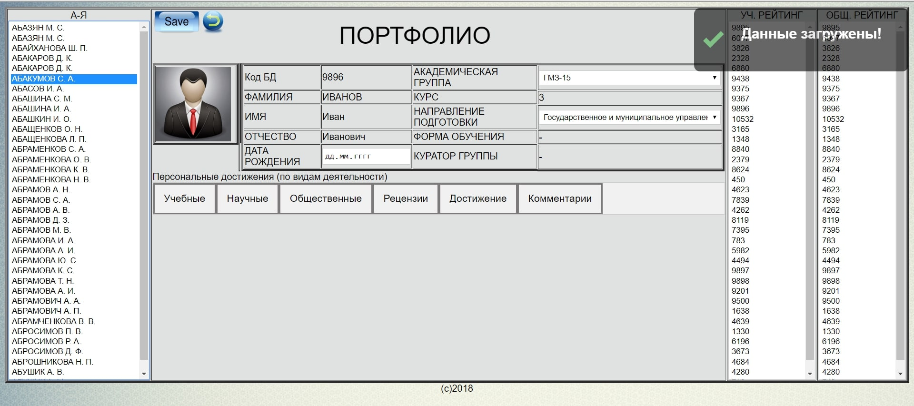
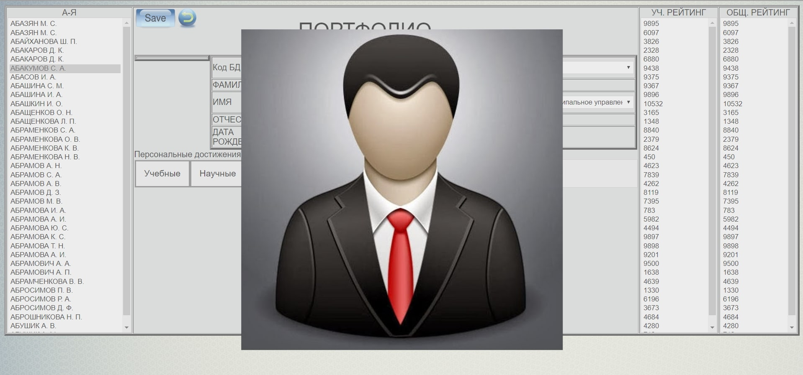

# Электронное портфолио студентов (php-Eportfolio-of-students)

База данных студентов, электронное портфолио студентов. Проект закрытый, разрешили выложить в свободный доступ только на стадии проектирования. Поэтому здесь только прототип. Дата создания 2018 год. Потраченое время на данном этапе: пару дней.

Для работы с базой данных использована библиотека Red Been PHP. Настройки базы данных includes/part.php. Структура создается из create-base.php.

Данные синхронизировались с базой данной Ms Access через драйвер SQL Oracle.
Авторизация осуществляется через другую базу "Единой Информационо-образовательный среды" учебного заведения.

